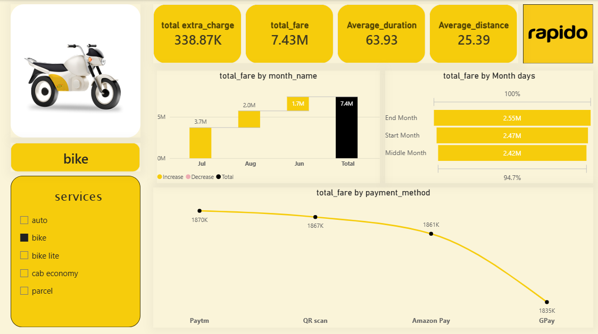

 # Rapido_Ride_Analytics

1. 📝 Short Description / Purpose
To analyze Rapido ride-booking data using Power BI to identify ride trends, revenue patterns, payment methods, service performance, and trip duration. The dashboard provides interactive insights to understand business performance and support data-driven decision-making.

2. 🛠️ Technologies / Tools
- Power BI
- Power Query
- DAX (Data Analysis Expressions)
- Data Visualization
- Data Cleaning & Transformation
- Excel

3. 📊 Data Source - github.com/jeetjodhani/power-bi_project/blob/main/rides_data.csv
The dataset contains ride-related information, including services, date, time, ride status, source, destination, duration, ride ID, distance, ride charges, extra charges, total fare, and payment methods.

4. 🚀 Features & Highlights
🔴 Business Problem
Rapido needs to understand its ride-booking performance, revenue generation, customer payment preferences, and service-wise performance. The business also needs to analyze monthly revenue trends, trip duration, and travel distance to identify patterns and improve operational efficiency.

🎯 Goal of the Dashboard
The main goal is to create an interactive Power BI dashboard that provides a clear overview of Rapido ride analytics, revenue trends, service categories, and payment methods.

💼 Business Impact
- Monitor overall ride revenue and extra charges.
- Analyze monthly revenue trends.
- Understand payment method preferences.
- Compare performance across different ride services.
- Evaluate average ride duration and distance.
- Support better operational and business decisions.

## 5. 📸 Dashboard Screenshot

### Rapido Bike Ride Analytics Dashboard

